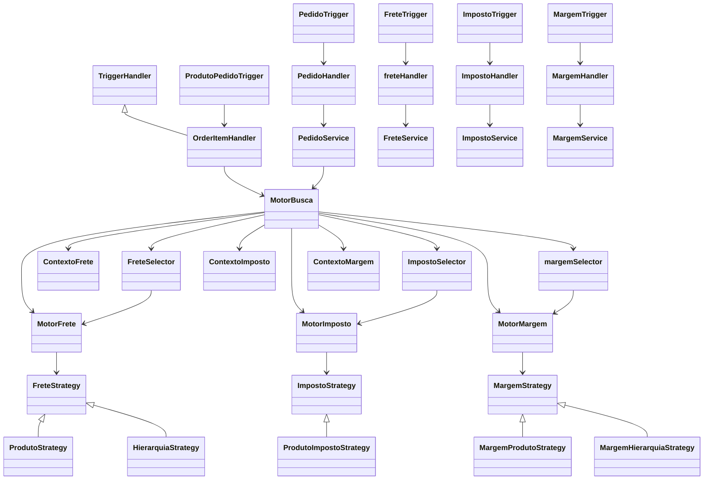
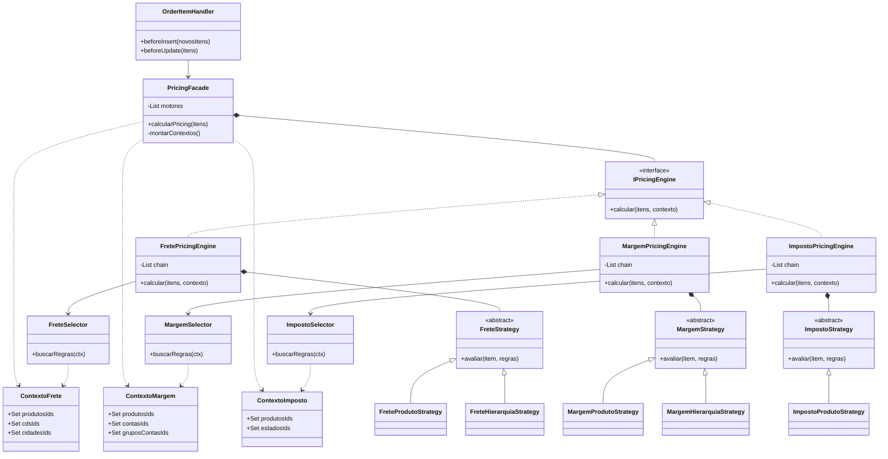

# Desafio Pricing

## Visao Geral

Este projeto Salesforce organiza a logica principal de pricing dentro da pasta `force-app`, com foco em tres frentes de calculo:

- `Frete`
- `Imposto`
- `Margem`

O fluxo mais importante do sistema acontece a partir de `OrderItem`, quando triggers e handlers executam motores de busca para encontrar as regras aprovadas de pricing com base em:

- produto ou hierarquia de produto
- conta ou grupo de conta
- centro de distribuicao
- localidade: cidade, estado e pais

## Estrutura Principal

Os modulos estao organizados majoritariamente por dominio:

- `force-app/main/default/classes/freteTriggerClass`
- `force-app/main/default/classes/impostoTriggerClass`
- `force-app/main/default/classes/margemTriggerClass`
- `force-app/main/default/classes/pedidoTriggerClass`
- `force-app/main/default/classes/produtoClass`
- `force-app/main/default/classes/produtoPedidoTriggerClass`V
- `force-app/main/default/classes/motorBusca`

Tambem existem objetos customizados relevantes para o motor de pricing:

- `Frete__c`
- `Imposto__c`
- `Margem__c`
- `Centro_de_Distribuicao__c`
- `Endereco__c`
- `Cidade__c`
- `Estado__c`
- `Pais__c`
- `Hierarquia_Produto__c`

## Padrao Arquitetural Atual

Boa parte do projeto segue este padrao:

`Trigger -> Handler -> Service/Motor -> Selector/Strategy`

Esse desenho aparece com bastante clareza em `frete`, `imposto`, `margem`, `pedido` e `order item`.

## UML Em Mermaid

## Fluxo Principal De Pricing

### 1. Entrada por `OrderItem`

O trigger `ProdutoPedidoTrigger` chama `OrderItemHandler`.

No `before insert` e `before update`, o handler executa:

- busca de frete
- busca de imposto
- busca de margem
- atribuicao de custo de producao

No `after insert`, ele tambem tenta mesclar itens duplicados do mesmo pedido.

### 2. Orquestracao em `MotorBusca`

`MotorBusca` e a classe central da logica de pricing. Ela:

- coleta IDs de produtos, pedidos, contas, grupos, CDs e localidades
- faz queries de apoio em `Order` e `Product2`
- chama os selectors
- instancia os motores
- monta os contextos
- aplica os resultados nos campos do `OrderItem`

### 3. Busca por regras

Cada dominio usa uma estrutura parecida:

- `Selector`: carrega regras candidatas do banco
- `Contexto`: representa os dados necessarios do item e do pedido
- `Motor`: tenta resolver a regra correta
- `Strategy`: define a ordem de tentativa, como produto antes de hierarquia

## Acoplamento Identificado

### Alto acoplamento em `MotorBusca`

`MotorBusca` concentra responsabilidades demais:

- query
- orquestracao
- criacao de contexto
- escolha de motor
- atribuicao de resultado ao item
- tratamento de erro

Na pratica, ele funciona como um "god class" do pricing.

### `OrderItemHandler` conhece demais o processo de pricing

O handler de `OrderItem` chama explicitamente frete, imposto, margem e custo. Isso cria dependencia forte entre trigger e regra de negocio.

Se qualquer regra de pricing mudar, a trigger de item sera impactada diretamente.

### Uso forte de metodos estaticos

Classes como `MotorBusca`, `PedidoService`, `FreteService`, `ImpostoService` e `MargemService` usam metodos estaticos em quase todo o fluxo.

Isso reduz flexibilidade para:

- testes unitarios mais isolados
- mock de dependencias
- substituicao de implementacao
- extensao do design

### Duplicacao de padrao entre dominios

Frete, imposto e margem repetem um modelo muito parecido de:

- selector
- contexto
- motor
- strategy

O padrao e bom, mas a implementacao esta repetida em vez de reaproveitada.

### Framework de trigger fragmentado

Existem varias classes base de trigger, como:

- `TriggerHandler`
- `PedidoTriggerHandler`
- `ProdutoTriggerHandler`
- `MargemTriggerHandler`
- `ImpostoTriggerHandler`
- `freteTriggerHandler`

Isso aumenta a manutencao sem trazer um beneficio claro equivalente.

## Problemas E Riscos Tecnicos Encontrados

### 1. Bug provavel na busca de margem por hierarquia

Em `margemSelector`, a query usa:

`Hierarquia_Produto__c IN :produtosIds`

Isso indica um problema de modelagem da consulta, porque `Hierarquia_Produto__c` deveria ser comparado contra um conjunto de hierarquias, nao de produtos.

### 2. `ContextoMargem` pode nao receber a hierarquia do produto

`ContextoMargem` depende de `item.Product2.Hierarquia_Produto__c`.

No fluxo de `OrderItem`, esse relacionamento nao e carregado explicitamente antes da criacao do contexto em todos os cenarios. Isso pode impedir a estrategia por hierarquia de funcionar como esperado.

### 3. `FreteSelector` recebe `locaisIds`, mas nao usa

O metodo recebe o parametro, mas a query ignora esse filtro. Isso aumenta o universo de dados carregados e reduz seletividade.

### 4. Fallback de frete por CD parece incompleto

O selector monta chave usando `Centro_Distribuicao__c` como fallback, mas a strategy de frete tenta apenas:

- cidade
- estado
- pais

Ou seja, um frete configurado apenas por CD pode nunca ser encontrado.

### 5. Validacoes de duplicidade escalam mal

As classes:

- `FreteService`
- `ImpostoService`
- `MargemService`

consultam praticamente todos os registros do objeto, excluindo apenas os IDs do lote atual. Em volumes maiores, isso pode gerar gargalo de performance.

### 6. `after insert` de `OrderItem` faz DML sem controle explicito de recursao

O metodo de mescla atual executa `update` e `delete` dentro do fluxo do trigger e menciona bypass apenas em comentario.

Sem um mecanismo de protecao real, existe risco de reprocessamento ou comportamento dificil de prever.

## Melhorias Recomendadas

### Prioridade Alta

#### 1. Quebrar `MotorBusca` em motores de aplicacao por dominio

Sugestao:

- `FretePricingEngine`
- `ImpostoPricingEngine`
- `MargemPricingEngine`

Cada engine pode cuidar da propria coleta de dados, selector, contexto e aplicacao do resultado.

#### 2. Corrigir o fluxo de margem por hierarquia

Necessario:

- coletar `hierarquiasIds` corretamente
- consultar `Hierarquia_Produto__c` com o conjunto certo
- garantir que o contexto receba a hierarquia em todos os fluxos

#### 3. Melhorar seletividade das queries

Os selectors e validadores devem buscar apenas registros candidatos ao lote atual, evitando leitura desnecessaria de grandes volumes.

### Prioridade Media

#### 4. Unificar o trigger framework

Criar uma unica classe base, por exemplo `BaseTriggerHandler`, com suporte padrao para:

- before insert
- before update
- after insert
- after update
- before delete
- after delete

#### 5. Padronizar nomenclatura

Hoje existem inconsistencias como:

- `freteHandler`
- `produtoService`
- `margemSelector`

O ideal e seguir um unico padrao de nomes, preferencialmente `PascalCase` para classes Apex.

#### 6. Extrair um contexto compartilhado de pricing

Uma classe de contexto comum poderia reduzir duplicacao entre:

- coleta de dados do pedido
- coleta de dados do produto
- localidade
- conta e grupo
- centro de distribuicao

### Prioridade Baixa

#### 7. Reduzir `System.debug` e melhorar observabilidade

Ha bastante `System.debug` espalhado no fluxo. Para um projeto mais maduro, vale centralizar logs relevantes e reduzir ruido.

#### 8. Melhorar mensagens e consistencia de erro

Exemplo: no fluxo de frete, uma mensagem de erro menciona margem. Isso indica oportunidade de padronizacao funcional e textual.

## Pontos Positivos Da Implementacao Atual

- Separacao por dominio facilita navegacao inicial no projeto
- Uso de `Selector + Motor + Strategy` e um bom caminho para regras com prioridade
- O projeto ja demonstra preocupacao com bulkification em varios pontos
- A orquestracao do pricing esta centralizada, o que facilita entender o fluxo principal

## Sugestao De Evolucao Arquitetural

Um caminho de refatoracao seguro seria:

1. Corrigir os bugs funcionais de margem e frete
2. Extrair servicos especificos para cada dominio de pricing
3. Introduzir um contexto compartilhado de pricing
4. Unificar handlers base
5. Melhorar cobertura de testes para cenarios de prioridade e fallback

## Casos De Teste Que Merecem Cobertura

- produto com regra especifica de frete
- fallback de frete por hierarquia
- prioridade cidade > estado > pais
- margem por conta
- margem por grupo de conta
- margem por hierarquia de produto
- imposto por produto + estado + CD
- pedido alterando endereco e recalculando itens
- tentativa de editar pedido com status `Ativo`
- tentativa de editar item de pedido ativo

## Conclusao

O projeto possui uma base promissora e uma intencao arquitetural boa, especialmente no uso de motores e estrategias para resolver regras de pricing.

O principal desafio atual nao e falta de estrutura, e sim excesso de concentracao em alguns pontos centrais, especialmente `MotorBusca`, alem de algumas inconsistencias que podem comprometer a corretude das regras de margem e frete.

Com pequenas correçoes funcionais e uma refatoracao incremental, a base pode evoluir para uma arquitetura mais coesa, mais testavel e com menor acoplamento.

