# UML — Motor de Atribuição de Metas
> v1.5 · Execução síncrona · Sem filtro de período · Batch apenas para achievement (09h)

---

## Fluxo de Execução

```
Trigger (sync — tudo na mesma transação)
  └─ OrderTriggerHandler
        └─ GoalAttributionFacade.process(changes)
              ├─ GoalRepository       → busca metas ativas do vendedor   (1 SOQL)
              ├─ GoalItemRepository   → busca itens dessas metas         (1 SOQL)
              ├─ OrderItemRepository  → busca todos os itens do vendedor (1 SOQL)
              ├─ para cada GoalItem:
              │     factory.getStrategy(recordType)
              │     strategy.match(orderItems, goalItem)  → filtra por ID
              │     calcula: Projetado / Negociado / Realizado
              └─ update Goal_Item__c  → 1 DML

Batch (agendado 09h — independente)
  └─ GoalAchievementBatch
        └─ verifica Realizado >= Target → atualiza Status da Meta
```

---

## Diagrama de Classes

```mermaid
classDiagram
    direction TB

    %% ════════════════════════════════════════
    %% TRIGGER LAYER
    %% ════════════════════════════════════════

    class OrderTriggerHandler {
        +afterUpdate(newMap, oldMap) void
        -filterStatusChanged(newMap, oldMap) List~OrderStatusChange~
    }

    class OrderStatusChange {
        <<Value Object>>
        +orderId Id
        +ownerId Id
        +fromStatus String
        +toStatus String
    }

    %% ════════════════════════════════════════
    %% FACADE
    %% ════════════════════════════════════════

    class GoalAttributionFacade {
        <<Facade>>
        -goalRepo IGoalRepository
        -goalItemRepo IGoalItemRepository
        -orderItemRepo IOrderItemRepository
        -factory GoalMatchingStrategyFactory
        +GoalAttributionFacade()
        +process(changes) void
        -extractOwnerIds(changes) Set~Id~
        -calculate(matched, goalItem) GoalItem_DTO
    }

    %% ════════════════════════════════════════
    %% INTERFACES — REPOSITORIES
    %% ════════════════════════════════════════

    class IGoalRepository {
        <<interface>>
        +findActiveByOwners(ownerIds) List~Goal_DTO~
    }

    class IGoalItemRepository {
        <<interface>>
        +findByGoals(goalIds) List~GoalItem_DTO~
    }

    class IOrderItemRepository {
        <<interface>>
        +findByOwners(ownerIds) List~OrderItem_DTO~
    }

    %% ════════════════════════════════════════
    %% REPOSITORIES — IMPLEMENTATIONS
    %% ════════════════════════════════════════

    class GoalRepository {
        +findActiveByOwners(ownerIds) List~Goal_DTO~
    }

    class GoalItemRepository {
        +findByGoals(goalIds) List~GoalItem_DTO~
    }

    class OrderItemRepository {
        +findByOwners(ownerIds) List~OrderItem_DTO~
    }

    %% ════════════════════════════════════════
    %% CMDT — wiring do factory
    %% ════════════════════════════════════════

    class Goal_Matching_Strategy__mdt {
        <<Custom Metadata>>
        +RecordType_DeveloperName__c String
        +Apex_Class_Name__c String
        +Active__c Boolean
    }

    %% ════════════════════════════════════════
    %% FACTORY
    %% ════════════════════════════════════════

    class GoalMatchingStrategyFactory {
        <<Factory>>
        -cmtMap Map~String_IGoalMatchingStrategy~
        +getStrategy(recordTypeDeveloperName) IGoalMatchingStrategy
        -loadFromCMDT() void
    }

    %% ════════════════════════════════════════
    %% INTERFACE — STRATEGY
    %% ════════════════════════════════════════

    class IGoalMatchingStrategy {
        <<interface>>
        +match(orderItems, goalItem) List~OrderItem_DTO~
    }

    %% ════════════════════════════════════════
    %% STRATEGIES — por Record Type
    %% critério: goalItem.xId == orderItem.xId
    %% ════════════════════════════════════════

    class ProductMatchingStrategy {
        +match(orderItems, goalItem) List~OrderItem_DTO~
        %% filtra: goalItem.productId == orderItem.productId
    }

    class FamilyMatchingStrategy {
        +match(orderItems, goalItem) List~OrderItem_DTO~
        %% filtra: goalItem.productFamily == orderItem.productFamily
    }

    class PerformanceMatchingStrategy {
        +match(orderItems, goalItem) List~OrderItem_DTO~
        %% retorna todos os itens do vendedor
    }

    class PaymentConditionMatchingStrategy {
        +match(orderItems, goalItem) List~OrderItem_DTO~
        %% filtra: goalItem.paymentCondition == orderItem.paymentCondition
    }

    %% ════════════════════════════════════════
    %% DTOs
    %% ════════════════════════════════════════

    class OrderItem_DTO {
        <<Value Object>>
        +id Id
        +ownerId Id
        +orderStatus String
        +productId Id
        +productFamily String
        +paymentCondition String
        +amount Decimal
    }

    class GoalItem_DTO {
        <<Value Object>>
        +id Id
        +goalId Id
        +recordTypeDeveloperName String
        +productId Id
        +productFamily String
        +paymentCondition String
        +target Decimal
        +projetado Decimal
        +negociado Decimal
        +realizado Decimal
    }

    %% ════════════════════════════════════════
    %% BATCH DE ACHIEVEMENT (09h)
    %% ════════════════════════════════════════

    class GoalAchievementBatch {
        <<Database.Batchable>>
        +start(ctx) Database.QueryLocator
        +execute(ctx, scope) void
        +finish(ctx) void
        -isAchieved(goal) Boolean
    }

    %% ════════════════════════════════════════
    %% RELATIONSHIPS
    %% ════════════════════════════════════════

    OrderTriggerHandler ..> OrderStatusChange : produces
    OrderTriggerHandler --> GoalAttributionFacade : calls

    GoalAttributionFacade --> IGoalRepository
    GoalAttributionFacade --> IGoalItemRepository
    GoalAttributionFacade --> IOrderItemRepository
    GoalAttributionFacade --> GoalMatchingStrategyFactory
    GoalAttributionFacade ..> GoalItem_DTO : updates + DML

    IGoalRepository <|.. GoalRepository : implements
    IGoalItemRepository <|.. GoalItemRepository : implements
    IOrderItemRepository <|.. OrderItemRepository : implements

    Goal_Matching_Strategy__mdt ..> GoalMatchingStrategyFactory : configures
    GoalMatchingStrategyFactory ..> IGoalMatchingStrategy : instantiates

    IGoalMatchingStrategy <|.. ProductMatchingStrategy : implements
    IGoalMatchingStrategy <|.. FamilyMatchingStrategy : implements
    IGoalMatchingStrategy <|.. PerformanceMatchingStrategy : implements
    IGoalMatchingStrategy <|.. PaymentConditionMatchingStrategy : implements

    IGoalMatchingStrategy ..> OrderItem_DTO : filters
    IGoalMatchingStrategy ..> GoalItem_DTO : reads criteria

    GoalAchievementBatch ..> IGoalRepository : reads goals
```



---

## Queries (sem filtro de período)

```sql
-- 1. Metas ativas do vendedor
SELECT Id, Owner__c
FROM Goal__c
WHERE Owner__c IN :ownerIds
AND Status__c = 'Ativo'

-- 2. Itens das metas
SELECT Id, Goal__c, RecordType.DeveloperName,
       Product__c, Product_Family__c, Payment_Condition__c, Target__c
FROM Goal_Item__c
WHERE Goal__c IN :goalIds

-- 3. Todos os itens de pedido do vendedor
SELECT Id, Product2Id, Product2.Family,
       Payment_Condition__c, UnitPrice,
       Order.Status, Order.OwnerId
FROM OrderItem
WHERE Order.OwnerId IN :ownerIds
AND Order.Status != 'Cancelled'
```

---

## Critério de match por Record Type

| Record Type | Chave Goal_Item | Chave Order_Item | Condição |
|---|---|---|---|
| Produto | `Product__c` | `Product2Id` | `goalItem.productId == orderItem.productId` |
| Família | `Product_Family__c` | `Product2.Family` | `goalItem.family == orderItem.family` |
| Performance | — | — | todos os order items do vendedor |
| Condição Pagamento | `Payment_Condition__c` | `Payment_Condition__c` | `goalItem.paymentCond == orderItem.paymentCond` |

---

## Recálculo total

```
Projetado__c = SUM(matched | orderStatus = 'New')
Negociado__c = SUM(matched | orderStatus = 'Pending Approval')
Realizado__c = SUM(matched | orderStatus = 'Approved')
```

Idempotente. Rejeição (`Pending → New`) sem lógica especial.

---

## O que cada classe produz para quem

| Quem | Produz | Para quem |
|---|---|---|
| `OrderTriggerHandler` | `List<OrderStatusChange>` | `GoalAttributionFacade` |
| `GoalRepository` | `List<Goal_DTO>` | `Facade` |
| `GoalItemRepository` | `List<GoalItem_DTO>` | `Facade` |
| `OrderItemRepository` | `List<OrderItem_DTO>` | `Facade` → `Strategy` |
| `GoalMatchingStrategyFactory` | `IGoalMatchingStrategy` | `Facade` |
| `IGoalMatchingStrategy` | `List<OrderItem_DTO>` filtrado | `Facade` (calcula) |
| `GoalAttributionFacade` | `update Goal_Item__c` | Salesforce DB |
| `GoalAchievementBatch` | `update Goal__c.Status__c` | Salesforce DB |

---

## Ordem de implementação

```
1. DTOs          → OrderStatusChange · OrderItem_DTO · GoalItem_DTO
2. Interfaces    → IGoalRepository · IGoalItemRepository · IOrderItemRepository
3. Strategies    → IGoalMatchingStrategy + 4 implementações
4. Factory       → GoalMatchingStrategyFactory + Goal_Matching_Strategy__mdt
5. Repositories  → GoalRepository · GoalItemRepository · OrderItemRepository
6. Facade        → GoalAttributionFacade
7. Trigger       → OrderTriggerHandler
8. Batch         → GoalAchievementBatch
```